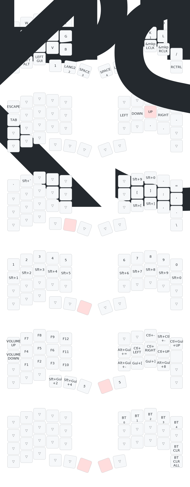

[torabo-tsuki](https://github.com/sekigon-gonnoc/torabo-tsuki)用のZMKファームウェア(実験用)

torabo-tsuki LP用は[こちら](https://github.com/sekigon-gonnoc/zmk-keyboard-torabo-tsuki-lp/)

通信頻度が上がった分、操作中も待機中も本来のファームウェアより消費電力が2倍になっています

* _centralがついているuf2をトラックボールがついている方に、_peripheralを反対側に書き込んでください
* キーマップはkeymap-editorおよびzmk-studioで編集できます
* ブートローダを起動するにはキーマップに&bootloaderを割り当てておくか、シリアルポートを1200bpsで開いてから閉じてください

## Keymap



## ブートローダの起動方法 (macOS)

シリアルポートを1200bpsで開いて閉じるとブートローダが起動します。

1. デバイス名を確認 (`tty.usbmodemXXXXXXX` のような名前)

   ```sh
   ls /dev/tty.usb*
   ```

2. `screen` で1200bpsで開く

   ```sh
   screen /dev/tty.usbmodemXXXXXXX 1200
   ```

3. `Ctrl + a` に続けて `k` を押し、確認プロンプトで `y` を入力して `screen` を終了します。シリアルポートが閉じられるとブートローダが起動します。
